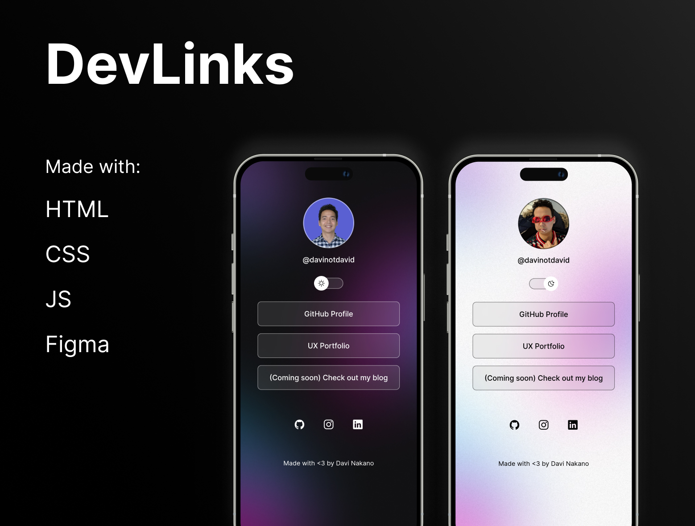

<h1 align="center"> DevLinks </h1>

A simple Linktree-esque website to hold important links so that I don't have to choose which link to put whenever I am prompted with a single input for that.

Check it out live <a href="https://davinotdavid.github.io/devlinks/">here</a>!

  <a href="#technologies">Technologies</a>&nbsp;&nbsp;&nbsp;|&nbsp;&nbsp;&nbsp;
  <a href="#project">Project</a>&nbsp;&nbsp;&nbsp;|&nbsp;&nbsp;&nbsp;
  <a href="#learnings">Learnings</a>&nbsp;&nbsp;&nbsp;

  

## Technologies

- HTML
- CSS
- JS (Vanilla)
- Git & Github (lol)
- Figma

## Project

Often times we have more links to share than we have inputs in some apps (looking at you, Instagram). As I am planning on increasing my online presence, it was important to have a "link aggregator".

I definitely could use [Linktree's free plan](https://linktr.ee/s/pricing/) for it but my needs seemed to be simple enough that I could code it myself!

## Learnings

It was a humbling experience to go back to plain HTML / CSS / JS after years working in a JS / framework-heavy environment.

Specially in CSS-land, I've learned how to toggle light and dark mode in a ~~sane~~ simple way through CSS variables.

Note to self: for simple projects like this one, there's definitely no need for a framework!
